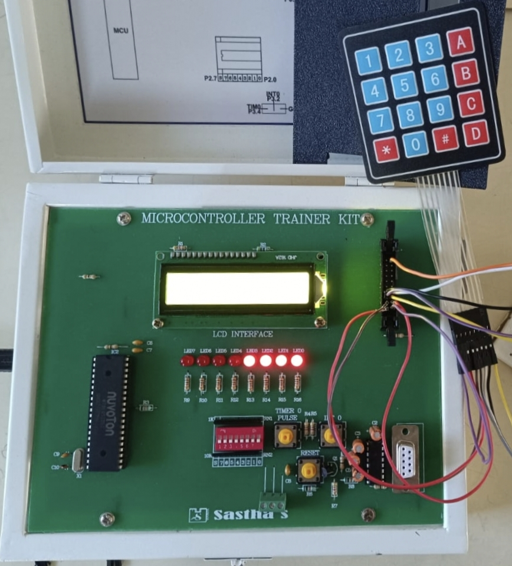
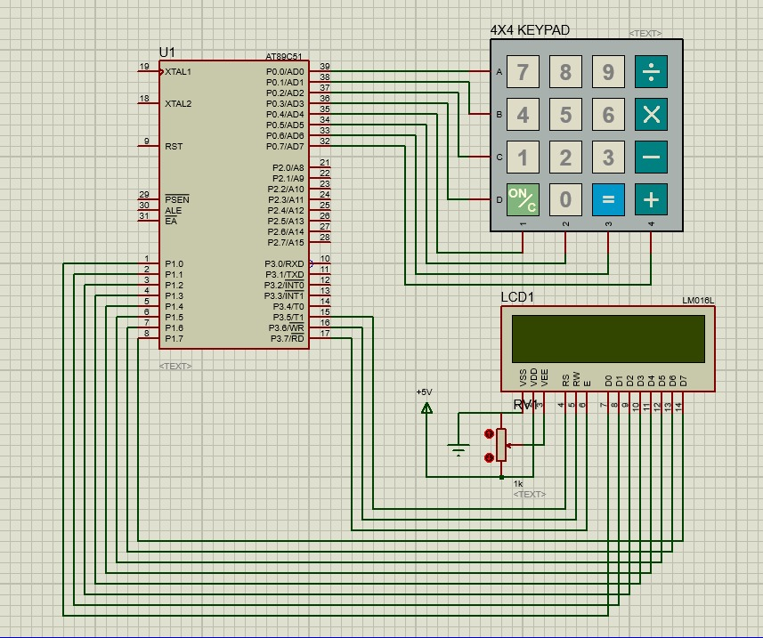

# 8051-Based Scientific Calculator

A fully functional scientific calculator built on the **8051 microcontroller (AT89C51)**, featuring arithmetic operations, trigonometric functions, and exponentiation — all implemented in Embedded C with a 4×4 matrix keypad and 16×2 LCD interface.

[Youtube link](https://youtu.be/oUOGsNmhVVI)

---

## Hardware Demo




*The working calculator on a Microcontroller Trainer Kit with 4×4 keypad and 16×2 LCD*

---

## Features

### Arithmetic Mode (`A` key → then 1/2/3/4)
| Key Combo | Operation |
|---|---|
| A → 1 | Addition (+) |
| A → 2 | Subtraction (−) |
| A → 3 | Multiplication (×) |
| A → 4 | Division (÷) |

### Trigonometric Mode (`D` key → then 1/2/3/4)
| Key Combo | Operation |
|---|---|
| D → 1 | sin(x) |
| D → 2 | cos(x) |
| D → 3 | tan(x) |
| D → 4 | cot(x) |

> Trig functions use a **precomputed sine LUT (0°–90°)** with quadrant symmetry and fixed-point arithmetic — no floating-point needed!

### Other Functions
| Key | Function |
|---|---|
| `*` | Exponentiation (x^y) |
| `#` | Enter / Execute (=) |
| `B` | Backspace (delete last digit) |
| `C` | Clear all (full reset) |

### Edge Case Handling
- Division by zero → displays `ERROR`
- Undefined trig results (tan 90°, cot 0°) → displays `INF`
- Continuous calculation: result of one operation becomes first operand of the next

---

## System Architecture

```
                        ┌──────────────────────────────────┐
                        │      8051 (AT89C51)              │
                        │                                  │
  4×4 Matrix    ──────▶│  PORT 0   STATE MACHINE          │
  Keypad (P0)           │           ├── Arithmetic Mode    │
                        │           ├── Trig Mode          │
                        │           └── Normal Mode        │
                        │                                  │
  16×2 LCD     ◀───────│  PORT 1 (Data) + PORT 3 (Ctrl)   │
                        └──────────────────────────────────┘
```

### Key Modules

**Clock & Timing**
- `delay_ms()` — software delay using nested loops for LCD timing and keypad debounce

**Keypad Driver**
- Row-column scanning on PORT 0
- 20ms debounce delay + key-release wait to prevent ghost presses

**LCD Driver**
- 8-bit mode via HD44780 controller
- `lcd_cmd()`, `lcd_data()`, `lcd_string()` — full command/data interface
- `display_number()` — integer rendering with sign support
- `display_trig()` — fixed-point decimal formatting (x.xxxx)

**Arithmetic Mode**
- State machine tracks: `num1`, `num2`, `op`, `mode`, `second` flag
- Result chains into `num1` for continuous calculations

**Trigonometric Mode**
- 91-entry `sin_table[]` stored in code memory (ROM)
- `get_sin()` — full 360° coverage via quadrant symmetry
- `get_cos()` — derived as `sin(90° − x)`
- `get_tan()` / `get_cot()` — computed using scaled integer division

**Exponent mode**
- `power(base, exp)` — iterative multiplication, overflow-safe

---

## Pin Mapping

| Port | Pin(s) | Connected To |
|---|---|---|
| P0 | P0.0–P0.3 | 4×4 Keypad rows |
| P0 | P0.4–P0.7 | 4×4 Keypad columns |
| P1 | P1.0–P1.7 | LCD Data Bus (D0–D7) |
| P3 | P3.5 | LCD RS |
| P3 | P3.6 | LCD RW |
| P3 | P3.7 | LCD EN |

---

## Proteus Simulation

The full circuit was designed and verified in **Proteus Design Suite** before hardware implementation.



The simulation includes:
- AT89C51 microcontroller with 11.0592 MHz crystal
- 4×4 matrix keypad (KEYPAD-SMALLCALC)
- LM016L 16×2 LCD display
- 10kΩ pull-up resistors on keypad lines
- Power supply decoupling

> KEYPAD-SMALLCALC didn't work properly in the simulation. So I created a matrix of push buttons with pullups to mimic the keypad myself.
---

## Components

| Component | Specification |
|---|---|
| Microcontroller | AT89C51 (8051) |
| Keypad | 4×4 Matrix, 16 keys |
| Display | 16×2 LCD (HD44780) |
| Pull-up Resistors | 10kΩ |

---

## How to Run

### Simulation (Proteus)
1. Open `Calculator8051.pdsprj` in Proteus Design Suite
2. Compile `src/calculator.c` using **Keil µVision** → generates `.hex` file
3. Load the `.hex` into the AT89C51 in Proteus
4. Run simulation and interact via the on-screen keypad

### Hardware
1. Compile with Keil µVision targeting 8051 / AT89C51
2. Flash the `.hex` to the AT89C51 using a programmer (e.g., Nuvoton, flash)
3. Wire up per the pin mapping table above
4. Power on — LCD initializes and waits for keypad input

### Usage Example
```
# Basic arithmetic:
  Press: 2 5 → A → 1 → 3 → #    → displays: 28   (25 + 3)

# Trigonometry:
  Press: 3 0 → D → 1             → displays: 0.500  (sin 30°)

# Exponentiation:
  Press: 2 → * → 8 → #           → displays: 256   (2^8)
```

---

## Key Concepts Demonstrated

- **Embedded C** programming for 8051 architecture
- **Matrix keypad scanning** with debounce
- **LCD interfacing** in 8-bit mode (HD44780)
- **State machine design** for multi-mode user input
- **Lookup tables (LUT)** for trigonometric computation without FPU
- **Fixed-point arithmetic** to represent decimals on integer hardware
- **Proteus simulation** for pre-hardware design verification

---

## References

1. [Keypad Interfacing with 8051 (AT89S52)](https://circuitdigest.com/microcontroller-projects/keypad-interfacing-with-8051-microcontroller)
2. [LCD 16×2: Pin Configuration and Working](https://www.elprocus.com/lcd-16x2-pin-configuration-and-its-working/)
3. [8051-based 4-digit Calculator — ResearchGate](https://www.researchgate.net/publication/344717848)
4. Mazidi, M.A., *The 8051 Microcontroller and Embedded Systems*, Pearson

---
